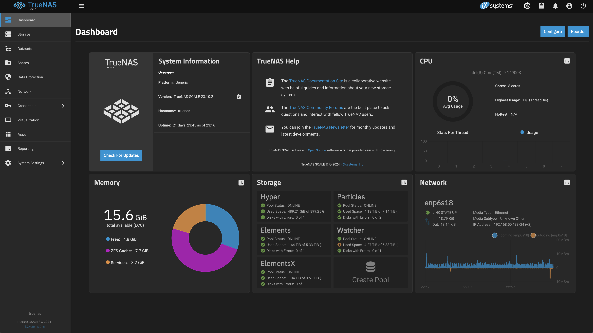
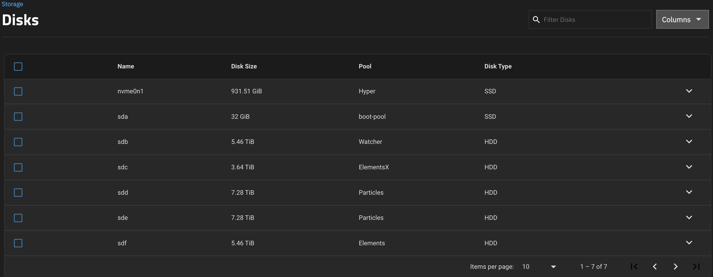
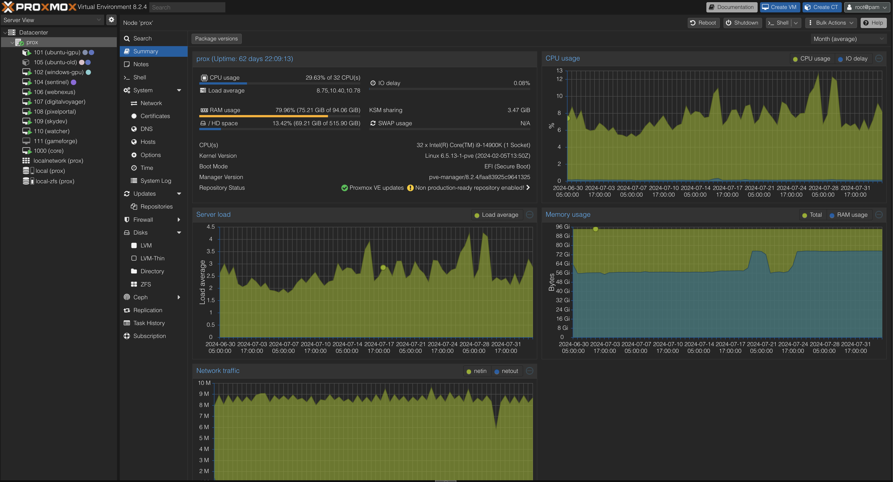
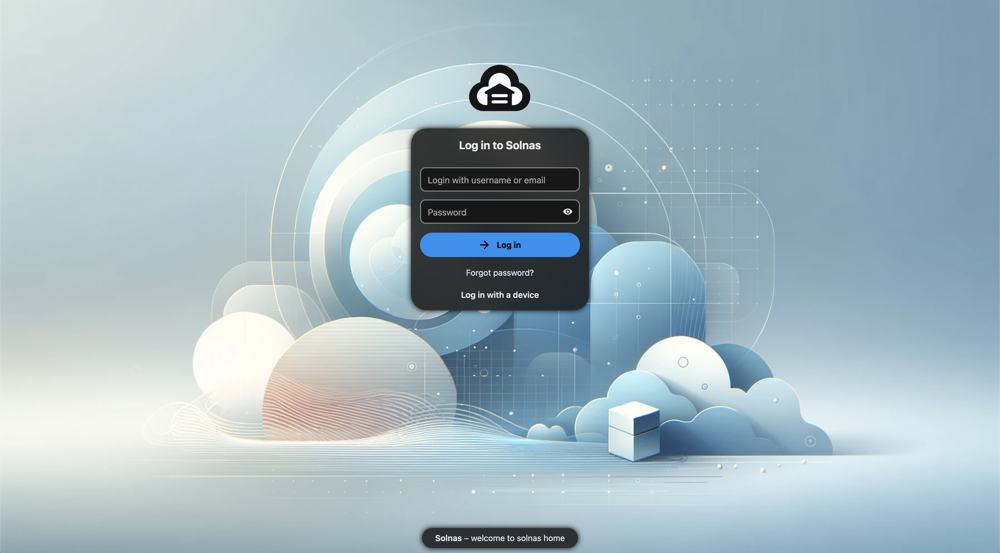

# Personal Home Server Portfolio - My Home Lab

🖥️ Welcome to my home lab! This repository showcases the configuration and tools I use to manage my personal home server, as well as a couple of **guides** that I created that may help others! 

Quick links:
- [GPU PASSTHROUGH GUIDE](https://github.com/nsoliven/HomeLAB/blob/main/proxmox/gpu-passthrough.md)

## 📝 About My Home Lab

At home, I use various hardware for different applications, but this document and GitHub repository will focus on two main servers. The first is a NAS machine, which distributes storage to my other server and various applications. The second is a Proxmox server, which hosts most of my applications and virtual machines, including those used for development, web servers, and more.

Some of the main applications include:
* **TrueNAS:** For active and quick storage between all applications and devices on the network.
* **DNS Sinkhole:** Actively blocking malicious or unwanted domains to improve my network security.
* **Virtual Machines:** Running isolated environments for various projects and experiments.
* **Personally Hosted Websites:** Hosting my own websites and web applications.
* **Personal Cloud Storage:** Providing a secure and private place to store my data.

## 🛠️ Technology Stack

My home lab setup leverages a mix of powerful tools:

* **Linux:** The foundation of my server, providing a stable and flexible operating system.
* **Docker:** For containerizing applications, making them easy to deploy and manage.
* **Authentik:** For identity and access management, providing secure authentication.
* **Proxmox:** A hypervisor for managing virtual machines and containers efficiently.
* **TrueNAS:** For robust and reliable network-attached storage, ensuring data integrity and availability.
* **Portainer:** A web-based management tool for simplifying Docker container management.
* **Docker Compose:** Streamlining the deployment of multi-container applications.
* **NGINX Proxy Manager:**  Securing my websites with HTTPS for privacy and trust.

## 📂 Repository Contents

* **docker-compose.yml:** Configuration files for deploying applications using Docker Compose.
* **scripts:** Helper scripts for managing various tasks on the server.
* **docs:** Additional documentation and notes on my setup and configurations.

## 🌱 Learning Journey

Through building and maintaining this home lab, I've gained valuable skills in:

* **Linux Administration:** Managing users, permissions, networking, and system services.
* **Docker and Containerization:** Packaging and deploying applications in isolated containers.
* **Networking and Security:** Configuring DNS, firewalls, and SSL certificates.

## 🤝 Feedback and Collaboration

I'm always looking to improve my home lab setup. If you have any suggestions, feedback, or want to collaborate on a project, please feel free to open an issue or reach out to me. 

Let's connect and learn together! 

## 🏞️ Images related

  
  
  
  

